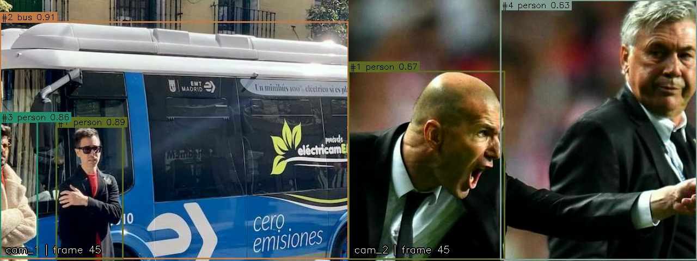
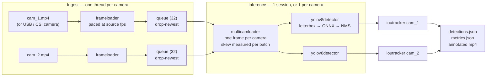

<div align="center">

# Real-Time Deepfake Detection

**Detecting manipulated faces in live video — built on a measured multi-camera inference pipeline, with an honest account of what every optimization cost.**




*Two cameras, one synchronized batch, tracked identities. Boxes, classes, confidences and `#track_id`s come straight out of `outputs/detections.json`.*

</div>

---

## Where this is

This repository is two halves of one system.

**The inference pipeline — finished and measured.** Multi-camera ingest, synchronized
batching, YOLOv8 through ONNX Runtime, IoU tracking, and a full optimization study
across execution providers and quantization schemes. Every number below is
reproducible with the commands in [Reproducing every number](#reproducing-every-number).

**The deepfake detector — in progress.** A face-manipulation classifier trained on
FaceForensics++, reusing that pipeline wholesale: the frame loaders, the tracker,
the metrics harness and the provider-selection logic are all unchanged. `ioutracker`
tracks faces with no modifications at all, because the face detector emits the same
detection contract the YOLOv8 detector does.

What exists today: dataset layout with an identity-leakage guard, face detection and
the FF++ crop convention, crop extraction, ground-truth metrics with frame-to-video
aggregation, an Xception fine-tuning loop, and a training-throughput study. What does
not exist yet: **a trained model or any accuracy number.** FaceForensics++ access is
pending, and nothing in this README claims a detection result that has not been
measured.

```bash
python src/deepfake/ffpp.py --manifest        # build the FF++ manifest, verify the splits
python src/deepfake/faces.py --video <path>   # face detection smoke test
python src/deepfake/bench_train.py            # training throughput and the memory cliff
```

See [`src/deepfake/`](src/deepfake/) and the commit history for the reasoning behind each piece.

---

## Headline results

Everything below was measured on this machine (Apple M2, 8 cores, macOS) and is reproducible with the
commands in [Reproducing every number](#reproducing-every-number).

| Question | Answer | Evidence |
|---|---|---|
| Is ONNX faster than PyTorch? | Yes, but barely on CPU — **1.13×** | [Runtime benchmark](#1-runtime-and-provider-sweep) |
| Does the Apple accelerator help? | **Yes — 3.6× over ONNX-on-CPU** (4.1× over PyTorch), 38.5 ms → 10.7 ms | [Runtime benchmark](#1-runtime-and-provider-sweep) |
| Is int8 quantization worth it? | **No, on this hardware.** Dynamic int8 is 1.9× *slower*; static int8 is fast only in the configuration that detects nothing at all | [Quantization study](#2-the-quantization-study) |
| Does quantization cost accuracy? | Working int8 variants lose 7–9% F1 against fp32 | [Fidelity check](#3-fidelity-what-did-the-speed-cost) |
| Does running cameras in parallel help? | **On the accelerator yes (1.5×); on CPU it makes things 1.6× worse** | [Pipeline scaling](#4-pipeline-scaling) |
| Best end-to-end configuration | fp32 + CoreML + one session per camera: **19.8 ms/batch, ~100 camera-fps** | [Pipeline scaling](#4-pipeline-scaling) |

The most useful result in this repo is a negative one: **the fastest quantized model detected zero
objects, and only a fidelity check against the fp32 model made that visible.** A speed benchmark on
its own would have shipped it.

---

## Contents

- [What this does](#what-this-does)
- [Quick start](#quick-start)
- [Architecture](#architecture)
- [How it works](#how-it-works)
  - [Frame loading and backpressure](#frame-loading-and-backpressure)
  - [Camera synchronization](#camera-synchronization)
  - [Preprocessing: letterboxing](#preprocessing-letterboxing)
  - [Parsing YOLOv8 output](#parsing-yolov8-output)
  - [Non-maximum suppression](#non-maximum-suppression)
  - [Tracking](#tracking)
  - [Parallel inference](#parallel-inference)
- [The optimization study](#the-optimization-study)
- [Configuration](#configuration)
- [Output formats](#output-formats)
- [Testing](#testing)
- [Reproducing every number](#reproducing-every-number)
- [Limitations and roadmap](#limitations-and-roadmap)

---

## What this does

1. **Reads several video sources concurrently** — one background thread per camera, each buffering
   into a bounded queue, paced at the source frame rate so a file behaves like a live camera.
2. **Hands out synchronized batches** — one frame per camera per batch, with timestamp spread
   measured and flagged when it exceeds a skew budget.
3. **Runs YOLOv8n through ONNX Runtime** — letterboxed preprocessing, vectorized class scoring, real
   NMS, boxes mapped back to original frame coordinates, on whichever execution provider suits the
   model.
4. **Tracks objects across frames** — greedy IoU association gives every object a stable `track_id`,
   with age-out for occlusion and a confirmation threshold against one-frame false positives.
5. **Measures everything** — per-stage latency, p95, FPS, dropped frames, sync skew, time spent
   waiting on I/O, all written to JSON next to the detections.
6. **Optimizes, then verifies** — export, quantize, benchmark across providers, and check what the
   optimized models actually detect compared to fp32.

---

## Quick start

```bash
git clone https://github.com/monishram2508/realtime-deepfake-detection.git
cd realtime-deepfake-detection

python -m venv venv && source venv/bin/activate      # Windows: venv\Scripts\activate
pip install -r requirements.txt

python src/create_video.py     # build two test camera feeds
python src/benchmark.py        # export ONNX, quantize, benchmark every provider
python src/demo.py --save-video
```

```
workers=auto -> 2 (provider CoreMLExecutionProvider)
pipeline: 2 camera(s), 2 worker(s), yolov8n.onnx on CoreMLExecutionProvider, tracking on
batch 0 - cam_1: 2, cam_2: 1 detections
batch 25 - cam_1: 3, cam_2: 2 detections
...
[METRICS] - detectionpipe:{'fps': 12.54, 'avg_latency': 18.68, 'p95_latency': 21.56, 'frames_dropped': 0, 'desyncs': 0}
[METRICS] - detector-cam_1:{'avg_latency': 15.21, 'stages_ms': {'preprocess': 1.07, 'inference': 12.82, 'postprocess': 1.28}}
done - 150 batches, 669 detections, 20 tracks
```

Everything lands in `outputs/`: `detections.json`, `metrics.json`, `benchmark.json`, and one
annotated `.mp4` per camera.

<details>
<summary><b>Other things you can run</b></summary>

```bash
python src/demo.py --batches 30                          # stop early
python src/demo.py --provider CPUExecutionProvider       # force a provider
python src/demo.py --workers 2                           # one ONNX session per camera
python src/demo.py --no-track                            # detections only, no identities
python src/demo.py --scaling                             # sweep workers x provider, write scaling.json

python src/benchmark.py --runs 30                        # model x provider sweep
python src/quantize.py --ablation                        # build every int8 variant and score it
python src/accuracy.py --frames 80                       # fidelity of each variant vs fp32
python -m pytest tests -q                                # 27 tests
```

</details>

> **Note on the test feeds.** `create_video.py` downloads two sample photos once and pans a crop
> window across each to fake a moving camera, so the detector has real people and vehicles to find.
> With no network it falls back to drawn shapes — the plumbing still runs, but a detector will
> correctly find nothing in them.

---

## Architecture



| File | Role |
|---|---|
| `src/config.py` | Paths, thresholds, provider preference, logging, COCO class names |
| `src/utils.py` | `timer`, `perfmetrics` (FPS / p95 / drops), `iou_matrix`, JSON writer |
| `src/frame_loader.py` | `frameloader` (one camera, one thread) and `multicamloader` (batching + skew) |
| `src/detection.py` | `letterbox`, `yolov8detector`, `detectionpipe`, provider selection, drawing |
| `src/tracker.py` | `ioutracker` — greedy IoU association, age-out, confirmation |
| `src/create_video.py` | Generates the test camera feeds |
| `src/benchmark.py` | Model × provider sweep, subprocess-isolated |
| `src/quantize.py` | Static (calibrated) int8 quantization + the ablation harness |
| `src/accuracy.py` | Detection fidelity of each variant against the fp32 model |
| `src/demo.py` | End-to-end entry point and the scaling study |
| `tests/` | 27 tests: geometry, output parsing, threading, tracking, fidelity metrics |
| `notes/` | My working notes — what each piece does and what I got wrong first |

---

## How it works

### Frame loading and backpressure

Each camera gets a thread and a bounded queue. When inference falls behind, the reader **drops the
newest frame rather than blocking**, which keeps end-to-end latency bounded instead of letting a
backlog grow until the pipeline is minutes behind reality.

```python
try:
    self.frame_queue.put_nowait({...})
    self.metrics.record_frame(read_ms)
except queue.Full:
    # inference is slower than I/O - drop rather than block
    self.metrics.record_drop()
```

Files are also **paced at the clip's own frame rate** by default. Reading a file as fast as the disk
allows fills the queue in a fraction of a second and reports hundreds of meaningless drops; pacing
makes the drop counter measure what it claims to. `--no-realtime` turns pacing off, and `--loop`
restarts clips at EOF so the source can never be the bottleneck during a throughput measurement.

### Camera synchronization

A batch is one frame from every camera. The loader measures the timestamp spread across each batch
and flags it when it exceeds `max_skew` (50 ms default):

```python
skew = max(f["timestamp"] for f in batch.values()) - min(f["timestamp"] for f in batch.values())
if skew > self.max_skew:
    self.sync_metrics.record_desync()
```

On file sources skew is an artifact of queue draining. On live cameras it is the signal that one
feed is lagging — which is exactly when a multi-camera system starts producing quietly wrong
results, because "the same moment" stops being the same moment.

### Preprocessing: letterboxing

Resizing a 640×480 frame directly to 640×640 stretches it vertically, and every box comes back
stretched with it. Letterboxing scales by the smaller ratio and pads the remainder:

```python
scale = min(new_size / h, new_size / w)
canvas = np.full((new_size, new_size, 3), 114, dtype=np.uint8)
canvas[pad_y:pad_y+nh, pad_x:pad_x+nw] = resized
```

The `(scale, pad_x, pad_y)` triple used on the way in is exactly what maps boxes back on the way
out — `x_original = (x_letterboxed - pad_x) / scale`. `tests/test_pipeline.py` pins that round trip,
because an error here produces boxes that look plausible and sit in the wrong place.

### Parsing YOLOv8 output

The raw output is `(1, 84, 8400)`: 4 box values plus 80 class scores for each of 8400 anchors.
**There is no objectness column** — that was YOLOv5. The class score *is* the confidence, and
multiplying by a phantom fifth column silently halves every score (which is exactly what my first
version did, so almost nothing survived the 0.5 threshold).

```python
preds = preds.transpose(1, 0)            # (84, 8400) -> (8400, 84)
scores_all = preds[:, 4:]                # 80 class scores, no objectness
class_ids  = np.argmax(scores_all, axis=1)
confs      = scores_all[np.arange(len(scores_all)), class_ids]
keep       = confs > conf_thresh         # vectorized: no Python loop over 8400 anchors
```

### Non-maximum suppression

8400 anchors mean the confident ones pile up on the same object — filtering by confidence alone
leaves a dozen boxes on one person. `cv2.dnn.NMSBoxes` keeps the highest-scoring box per overlapping
cluster at `iou_thresh=0.45`.

### Tracking

Detection answers "what is in this frame". Tracking answers "is that the same person as last frame",
which is what counting, dwell time and cross-camera hand-off all need. `ioutracker` does greedy
IoU association, highest overlap first:

```python
order = sorted(((ious[i, j], i, j) for i in ... ), reverse=True)
for score, i, j in order:
    if score < self.iou_thresh: break
    if i in used_tracks or j in used_dets: continue
    self.tracks[i].update(detections[j], self.frame_index)
```

Two details that matter more than the matching itself:

- **`max_age`** keeps a track alive for a few unmatched frames, so one missed detection or a brief
  occlusion does not reset an object's identity.
- **`min_hits`** withholds a track from output until it has been seen twice, which suppresses
  single-frame false positives.

Association is class-aware: the same box labelled `person` in one frame and `car` in the next is not
the same object. No motion model and no appearance embedding — both are in the
[roadmap](#limitations-and-roadmap), and both are what you would add for crowded or moving scenes.

### Parallel inference

With `workers > 1` each camera gets its own ONNX session and they run in a thread pool. This works in
Python because **ONNX Runtime releases the GIL inside `session.run`**, so the threads genuinely
overlap. Whether it *helps* depends entirely on the provider — see
[Pipeline scaling](#4-pipeline-scaling). The default (`--workers 0`) picks from the provider:

```python
if workers == 0:
    probe = provider or pick_provider(self.model_path)
    workers = 1 if probe == "CPUExecutionProvider" else len(self.cam_ids)
```

---

## The optimization study

### Methodology

Every configuration in the sweep runs **in its own subprocess**. Sessions built in one process
compete for threads and leave the CPU warm; during development that was enough to move fp32 CPU
numbers by 50% between runs. Isolation costs a few seconds of process startup and buys numbers that
reproduce. Each measurement discards 3 warm-up runs and reports the mean and p95 of 30 timed runs.

```python
proc = subprocess.run([sys.executable, __file__, "--single", target, provider, ...])
```

### 1. Runtime and provider sweep

`python src/benchmark.py --runs 30` → `outputs/benchmark.json`

| Model | Provider | Mean | p95 | FPS | Size | vs PyTorch |
|---|---|---|---|---|---|---|
| PyTorch (ultralytics) | — | 43.6 ms | 46.4 ms | 22.9 | 6.5 MB | 1.00× |
| ONNX fp32 | CPU | 38.5 ms | 45.1 ms | 26.0 | 12.8 MB | 1.13× |
| **ONNX fp32** | **CoreML** | **10.7 ms** | **11.5 ms** | **93.1** | 12.8 MB | **4.06×** |
| ONNX int8 dynamic | CPU | 71.7 ms | 85.7 ms | 14.0 | 3.5 MB | 0.61× |
| ONNX int8 dynamic | CoreML | 104.3 ms | 125.9 ms | 9.6 | 3.5 MB | 0.42× |
| ONNX int8 static | CPU | 41.4 ms | 49.6 ms | 24.2 | 6.3 MB | 1.05× |
| ONNX int8 static | CoreML | 106.8 ms | 119.9 ms | 9.4 | 6.3 MB | 0.41× |

Two things fall out of this table.

**Quantized models are catastrophically slow on the accelerator.** ONNX Runtime prints why, and the
benchmark parses it back out of the log rather than discarding it:

```
CoreMLExecutionProvider::GetCapability,
  number of partitions supported by CoreML: 128
  number of nodes in the graph: 934
  number of nodes supported by CoreML: 157
```

A QDQ-quantized graph is full of Quantize/Dequantize pairs CoreML cannot take, so the graph is split
into 128 partitions and the copies between CPU and accelerator cost far more than the accelerator
saves. The fp32 graph splits into 11 partitions with 221 of 233 nodes accepted, and runs 4× faster
than the CPU. That rule is encoded in the provider chooser:

```python
def pick_provider(model_path):
    if "int8" in str(model_path).lower():
        return "CPUExecutionProvider"      # quantized graphs fragment on accelerators
    for candidate in provider_preference:  # CUDA -> CoreML -> CPU
        if candidate in available_providers():
            return candidate
```

**Dynamic int8 is slower than fp32 on the CPU too.** Dynamic quantization computes activation scales
at runtime; on this ARM CPU that overhead beats the cheaper matmuls. It does shrink the model 3.7×,
which matters if you are shipping to a device, not if you are chasing latency.

### 2. The quantization study

Dynamic quantization being slow is what motivated static (calibrated) quantization: run real frames
through the fp32 model first, record the range of every activation tensor, bake those scales into
the graph, and nothing is measured at runtime.

```python
quantize_static(
    prepped, out_path,
    calibration_data_reader=videocalibrationreader(frames, "images"),
    quant_format=QuantFormat.QDQ,
    per_channel=True,
    activation_type=QuantType.QUInt8,
    weight_type=QuantType.QInt8,
    calibrate_method=CalibrationMethod.MinMax,
)
```

Calibration frames are sampled evenly across every camera clip and preprocessed through the **exact
same letterbox path the detector uses** — calibrating on data that does not look like deployment
data is the classic way to get a fast model that detects nothing.

It got a fast model that detected nothing anyway:

```
yolov8n.onnx              box[min,max]=(2.8, 640.8)   score[max]=0.9024   boxes>0.5 = 30
yolov8n_int8_static.onnx  box[min,max]=(2.5, 641.3)   score[max]=0.0000   boxes>0.5 =  0
```

The box regression survived quantization perfectly. The classification scores collapsed to zero.
The reason is in the shape of the data: the classification branch produces a handful of large logits
among 8400 mostly-negative ones, and a single uint8 activation scale across that range rounds every
positive logit into the same bucket. After the sigmoid, everything is zero — a model that is
confidently certain there is nothing there.

`python src/quantize.py --ablation` builds every variant and scores each against fp32:

| Variant | Detections | F1 vs fp32 | Size |
|---|---|---|---|
| fp32 (reference) | 51 | 1.000 | 12.8 MB |
| static / whole graph | **0** | 0.000 | 3.6 MB |
| static / entropy calibration | **0** | 0.000 | 3.6 MB |
| static / classification branch in fp32 | **0** | 0.000 | 5.1 MB |
| static / **whole detection head in fp32** | 47 | **0.959** | 6.3 MB |

Changing the calibration method does not help — this is not a calibration problem, it is that the
detection head cannot be represented in uint8. Excluding only the classification branch is not
enough either; the whole head (`/model.22/`, 66 nodes) has to stay in float:

```bash
python src/quantize.py --exclude /model.22/     # the default
python src/quantize.py --quantize-head          # reproduces the silent failure above
```

And that is the punchline: **the working static model is 41.4 ms — no faster than plain fp32 on the
CPU (38.5 ms), and four times slower than fp32 on CoreML (10.7 ms).** On this hardware, every
quantization path is a dead end. The version that is fast does not work, and the version that works
is not fast. Quantization stays interesting for the 2× size reduction on a memory-constrained
device, and for hardware with int8 kernels worth using (Jetson, Hexagon, x86 VNNI) — not here.

### 3. Fidelity: what did the speed cost?

`python src/accuracy.py --frames 40` → `outputs/accuracy.json`

Detections from the fp32 CPU model are the reference; each candidate is matched against it with
class-aware greedy IoU matching at 0.5. This measures **fidelity to the unquantized model**, not
COCO mAP — real mAP needs a labelled dataset, and the question quantization raises is precisely
"did the optimization change what the model sees".

| Variant | Detections | F1 vs fp32 | Mean IoU | Missed | Spurious | Mean conf delta |
|---|---|---|---|---|---|---|
| fp32 / CPU (reference) | 84 | 1.000 | 1.000 | 0 | 0 | +0.000 |
| fp32 / CoreML | 85 | 0.994 | 0.997 | 0 | 1 | +0.003 |
| int8 dynamic / CPU | 80 | 0.915 | 0.969 | 9 | 5 | −0.018 |
| int8 static / CPU | 86 | 0.929 | 0.980 | 5 | 7 | −0.019 |

The accelerator is numerically almost identical to the CPU (F1 0.994, one extra borderline
detection) — a 4× speedup for no meaningful change in what the model reports, which is the rare case
where an optimization is simply free. Both int8 variants lose 7–9% F1 and shift confidences
down by about 0.02, enough to push borderline objects across the threshold in both directions.

### 4. Pipeline scaling

`python src/demo.py --scaling --batches 100` → `outputs/scaling.json`

End-to-end, two cameras, unpaced and looping so the source never starves the pipeline (the
`waiting on frames` column is how that claim is verified rather than assumed):

| Provider | Workers | Batch latency | p95 | Waiting on frames | Batches/s | Camera-fps |
|---|---|---|---|---|---|---|
| CPU | 1 | 109.9 ms | 150.2 ms | 0.1 ms | 9.1 | 18.2 |
| CPU | 2 | 176.4 ms | 229.6 ms | 0.1 ms | 5.7 | 11.3 |
| CoreML | 1 | 29.1 ms | 31.7 ms | 0.1 ms | 34.3 | 68.6 |
| **CoreML** | **2** | **19.8 ms** | **28.5 ms** | 0.1 ms | **50.2** | **100.4** |

**On the CPU, a second worker makes everything 1.6× worse.** ONNX Runtime's CPU provider already
parallelizes a single inference across every core; a second session spawns a second thread pool and
the two oversubscribe the machine. **On CoreML, a second worker is a 1.5× win**, because the
accelerator runs one graph at a time and the freed CPU handles the other camera's decode,
letterboxing and NMS concurrently.

This is why `--workers` defaults to auto rather than to a fixed number: the right answer is a
property of the provider, not of the code.

*(CPU rows vary ±20% between runs because the CPU provider competes with everything else on the
machine; the CoreML rows reproduce within ±5%.)*

### What the numbers say overall

| Stage | fp32 / CPU | fp32 / CoreML |
|---|---|---|
| Preprocess (letterbox, normalize, HWC→CHW) | 0.8 ms | 1.1 ms |
| Inference | 38.7 ms (96%) | 12.8 ms (84%) |
| Postprocess (score, NMS, rescale) | 0.8 ms | 1.3 ms |
| **Per frame** | **40.3 ms** | **15.2 ms** |

Inference is 96% of the CPU frame budget, so it is the only stage worth optimizing — every
preprocessing micro-optimization on the table is worth under a millisecond. Of the four things
tried, exactly one was a real win: **using the right execution provider (4×), then overlapping
cameras on it (1.5× more)**. Quantization, the optimization that "should" have helped, cost
accuracy and delivered nothing on this hardware.

---

## Configuration

Everything tunable is in `src/config.py`:

```python
conf_thresh = 0.5      # confidence floor, applied before NMS
iou_thresh  = 0.45     # NMS overlap threshold
input_size  = 640      # model input dimension
target_fps  = 10       # what the pipeline aims for
target_latency = 100   # ms

# tried in order for float models; int8 models are pinned to CPU
provider_preference = ["CUDAExecutionProvider", "CoreMLExecutionProvider", "CPUExecutionProvider"]
```

Component-level knobs:

```python
multicamloader(paths, queue_size=32, max_skew=0.050, realtime=True, loop=False)
ioutracker(iou_thresh=0.3, max_age=5, min_hits=2)
detectionpipe(paths, model_path=None, provider=None, workers=0, track=True)
```

---

## Output formats

<details open>
<summary><code>outputs/detections.json</code></summary>

```json
[
  {
    "batch_index": 20,
    "timestamp": 1788684028.11376,
    "cameras": {
      "cam_1": {
        "frame_index": 20,
        "detection_count": 3,
        "detections": [
          {
            "x": 1.5, "y": 158.5, "w": 636.0, "h": 315.0,
            "conf": 0.893, "class_id": 5, "class_name": "bus",
            "track_id": 2, "track_hits": 21, "confirmed": true
          }
        ]
      },
      "cam_2": { "...": "..." }
    }
  }
]
```

Boxes are top-left `x, y` plus `w, h` **in the original frame's pixels**, not letterboxed
coordinates.

</details>

<details>
<summary><code>outputs/metrics.json</code></summary>

```json
{
  "model": "yolov8n.onnx",
  "provider": "CoreMLExecutionProvider",
  "workers": 2,
  "pipeline": {
    "fps": 12.54, "avg_latency": 18.68, "p95_latency": 21.56,
    "frames_processed": 150, "frames_dropped": 0, "desyncs": 0,
    "avg_wait_for_frames_ms": 47.69
  },
  "detectors": {
    "detector-cam_1": {
      "avg_latency": 15.21, "p95_latency": 17.14, "provider": "CoreMLExecutionProvider",
      "stages_ms": { "preprocess": 1.07, "inference": 12.82, "postprocess": 1.28 }
    }
  },
  "cameras": { "cam_1": { "fps": 12.54, "frames_dropped": 0 } },
  "sync":     { "desyncs": 0, "avg_latency": 47.69 },
  "tracking": { "cam_1": { "active_tracks": 3, "confirmed_tracks": 3,
                           "total_tracks_created": 9, "mean_track_length": 115.0 } }
}
```

</details>

Also written: `benchmark.json`/`.md`, `accuracy.json`/`.md`, `scaling.json`/`.md`,
`quantization_ablation.json`/`.md` — every table in this README is a file in `outputs/`.

---

## Testing

```bash
python -m pytest tests -q
# 27 passed
```

| File | Covers |
|---|---|
| `tests/test_pipeline.py` | Letterbox geometry and its inverse, preprocessing contract, output parsing with a planted box, confidence filtering, thread lifecycle, unequal-length cameras, missing files, metric percentiles |
| `tests/test_tracker.py` | IoU maths, identity across movement, new ids after jumps, two objects staying separate, class-aware association, occlusion recovery then age-out, confirmation thresholds |
| `tests/test_optimization.py` | Provider selection rules, calibration reader shapes and exhaustion, fidelity metric maths (perfect match, missed, spurious, confidence drift, greedy best-overlap) |

Tests needing an exported model skip themselves, so CI runs in under a minute without installing
PyTorch. See [`.github/workflows/tests.yml`](.github/workflows/tests.yml).

---

## Reproducing every number

```bash
python src/create_video.py                      # test feeds
python src/benchmark.py --runs 30               # table 1  -> outputs/benchmark.md
python src/quantize.py --ablation --samples 32  # table 2  -> outputs/quantization_ablation.md
python src/accuracy.py --frames 40              # table 3  -> outputs/accuracy.md
python src/demo.py --scaling --batches 100      # table 4  -> outputs/scaling.md
python src/demo.py --save-video                 # the hero image
```

Hardware: Apple M2, 8 cores, macOS, Python 3.9, onnxruntime 1.19.2, ultralytics 8.4.53, YOLOv8n at
640×640. Numbers on your machine will differ; the scripts print yours.

---

## Limitations and roadmap

**What this is not.** Single-machine, file-or-webcam input, one model shared across cameras, and
fidelity measured against fp32 rather than ground truth. The tracker has no motion model, so fast
motion or crowds will swap identities. Cross-camera identity association is not implemented — each
camera tracks independently.

**Next, in the order I would do it:**

- [ ] **Real cameras** — `cv2.VideoCapture(0)` or a CSI pipeline drops straight into `frameloader`;
      the interface was built for it, and the skew metric finally becomes meaningful
- [ ] **COCO mAP** against a labelled subset, so accuracy is measured absolutely and not only
      relative to fp32
- [ ] **Kalman motion model + Hungarian assignment** (SORT), replacing greedy IoU association
- [ ] **Cross-camera association** — the actual multi-camera problem: one identity across views
- [ ] **Static quantization on hardware with real int8 kernels** (Jetson, x86 VNNI), where the
      negative result above should flip
- [ ] **Batched inference** — feed both cameras as one batch instead of two sessions
- [ ] **Health checks** — detect a stalled camera and degrade instead of blocking

---

## Notes

`notes/notes.md` and `notes/definitions.md` are my working notes from building this: how each
component works, what I got wrong in the first version (YOLOv5 output parsing on a YOLOv8 model,
resize instead of letterbox, confidence filtering mistaken for NMS), and what the measurements
actually said.

## License

MIT — see [LICENSE](LICENSE).
